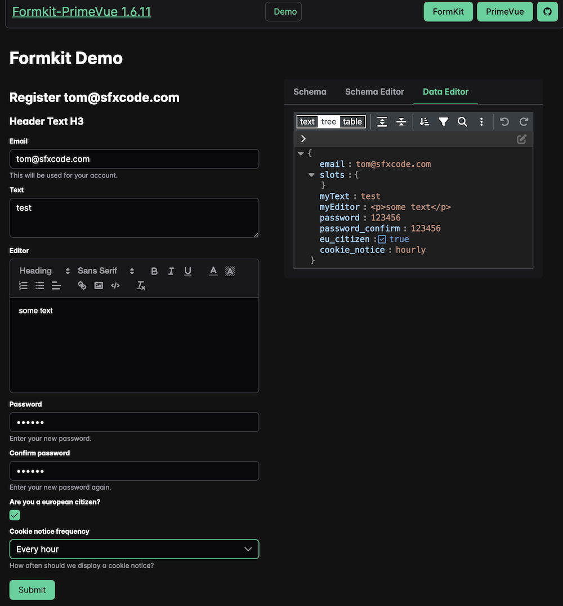

# Formkit - Primevue

PrimeVue based formkit inputs for using [FormKit](https://formkit.com/) with the [PrimeVue UI Framework](https://www.primefaces.org/primevue/#/).

Main focus of this project is to provide configuration based forms with validation.

## PrimeVue Versions

Actual PrimeVue Version in the main branch is *4.x.*

PrimeVue 3 is in the prime3 branch.

## Docs

[Docs](https://sfxcode.github.io/formkit-primevue/)

[Demo/Playground](https://formkit-primevue.netlify.app/)

## Usage

### Configuration

Add *formkit.config.ts*


```typescript
import { defaultConfig, plugin } from '@formkit/vue'
import { primeInputs } from '@sfxcode/formkit-primevue'

app.use(plugin, defaultConfig({
  locales: { de, en },
  // Define the active locale
  locale: 'en',
  inputs: primeInputs,
}))
```

### Nuxt

Important: use *autoimport: false* if using primevue formkit validation and include or
exclude not needed components as usual.

Autoimport true prevents elements lookup correctly. 

Example:
```typescript
  primevue: {
  autoImport: false,
    components: {
    exclude: ['Chart', 'Editor'],
  },
  options: {
    theme: {
      preset: Aura,
        options: {
        darkModeSelector: '.dark',
      },
    },
    ripple: true,
  },
},
```

## Limitations

Prefixing of the PrimeVue component names is not supported.

### Schema Helper Functions

[useFormKitSchema](https://github.com/sfxcode/formkit-primevue/blob/main/src/composables/useFormKitSchema.ts) provide functions to simplify the usage of elements, components, lists, ...

[useInputEditorSchema](https://github.com/sfxcode/formkit-primevue/blob/main/src/composables/useInputEditorSchema.ts) provide functions for a component schema generation builder

### Basic Styling

Basic styling is provided with the [formkit-primevue.scss](https://github.com/sfxcode/formkit-primevue/blob/main/src/sass/formkit-primevue.scss) file.

Features:

- Width of all text and dropdown elements is set to 100%
- Error Color by variable (--formkit-error-color)
- Some margins, font sizes ...

You can use it or take it as base for your own styling.

### Extended Styling

- All inputs are wrapped in a div with a **p-formkit** class
- Most Prime Components have access to class / styles attributes
- PT and PTOptions are available ([https://primevue.org/passthrough/](https://primevue.org/passthrough/))
- [Styling](https://formkit-primevue.netlify.app/styling/base) and [PT](https://formkit-primevue.netlify.app/styling/passThrough) demo available

### Samples

Some samples for common tasks are available

- [Repeater](https://formkit-primevue.netlify.app/samples/repeater) (with the help of the useFormKitSchema composable)
- [Grid](https://formkit-primevue.netlify.app/samples/grid)
- [Input Editor](https://formkit-primevue.netlify.app/samples/inputEditor) (let you test the configurations in your schema file)

## Showcases

[Demo Application](https://formkit-primevue.netlify.app/)

[Nuxt 3 PrimeVue Starter](https://github.com/sfxcode/nuxt3-primevue-starter) and [Vite PrimeVue Starter](https://github.com/sfxcode/vite-primevue-starter) with Formkit support available.

## Supported Inputs

- AutoComplete
- Calendar
- CascadeSelect
- Checkbox
- Chips
- Dropdown
- Editor (HTML Editor)
- InputMask
- InputNumber
- InputOtp
- InputSwitch
- InputText
- InputTextarea
- MultiSelect
- Password
- Ranking
- Knob
- ColorPicker
- Listbox
- ToggleButton
- SelectButton
- TriStateCheckbox
- RadioButton
- TreeSelect

## Demo
[Demo/Playground](https://formkit-primevue.netlify.app/)


